# Ασκήσεις
---
## Άσκηση 1
Να δημιουργηθεί το σήμα  διακριτού χρόνου

```math
x[n] = [1 \quad 2 \quad \underset{\uparrow}{3} \quad 4 \quad 5 \quad 6 \quad 7 \quad 6 \quad 5 \quad 4 \quad 3 \quad 2 \quad 1]
```

Σε  έξι  υποπαράθυρα  του  ίδιου  γραφικού  παράθυρου  να  δημιουργηθούν  οι  γραφικές παραστάσεις των :

```math
a) x[n] \quad b) x[n-5] \quad c) x[n+4] \quad d) x[-n] \quad e) x[n/2] \quad f) x[2n]
```

<p align="center">
  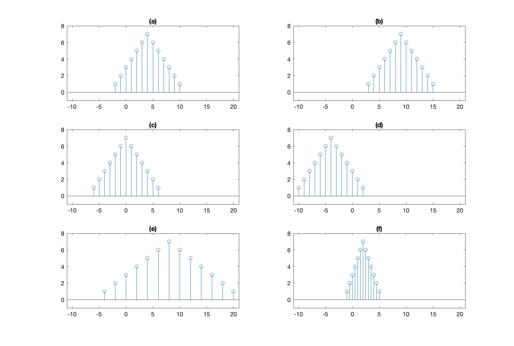
</p>

---
## Άσκηση 2
Nα σχεδιαστούν τα σήματα διακριτού χρόνου <br>
α)

```math
𝑦[𝑛]=2∗𝑢[𝑛−(2+𝐴𝑀𝐿 𝑚𝑜𝑑 5)]−8∗δ[𝑛− 𝐴𝑀𝐿 𝑚𝑜𝑑 4]  \\
\quad για \quad 𝑛=−20−(𝐴𝑀𝐿 𝑚𝑜𝑑 2):20+(𝐴𝑀𝐿 𝑚𝑜𝑑 2)
```

β)

```math
x[n] = \begin{cases}
    3n, &  -5 \leq n \leq -1 \\
    e^n, &  -1 < n \leq 2 \\
    \sqrt{4 \cdot \text{sum}(AM)}, &  -2 < n \leq 10
\end{cases}
```

Όπου ΑΜ ο αριθμός μητρώου σας, `sum(AM)` το μονοψήφιο άθροισμα των ψηφίων του, AML το τελευταίο ψηφίο του ΑΜ σας, και `u[n]` και `δ[n]` η μοναδιαία βηματική και η μοναδιαία κρουστική ακολουθία αντίστοιχα. 

<p align="center">
  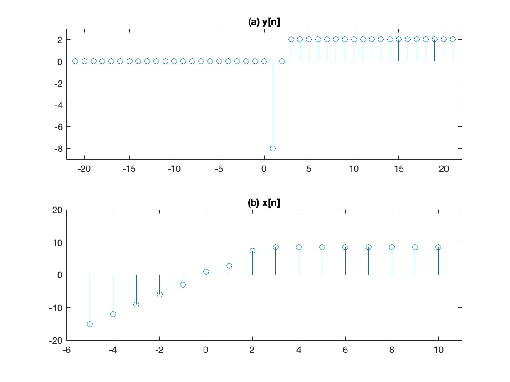
</p>

---
## Άσκηση 3
Να σχεδιαστούν τα παρακάτω σήματα και για όσα είναι περιοδικά να προσδιοριστεί η θεμελιώδης περίοδός τους και να γίνει γραφική επαλήθευση της περιοδικότητάς τους. 

```math
x_1[n] = \cos(0.2\pi n + \pi/3) 
```

```math
x_2[n] = \cos(0.1\pi n + \pi/4)
```

```math
x_3[n] = \cos(0.01\pi n + \pi/5)
```

```math
y[n] = x_1[n] + x_2[n] 
```

```math
z[n] = x_1[n] + x_2[n] + x_3[n]
```

<p align="center">
  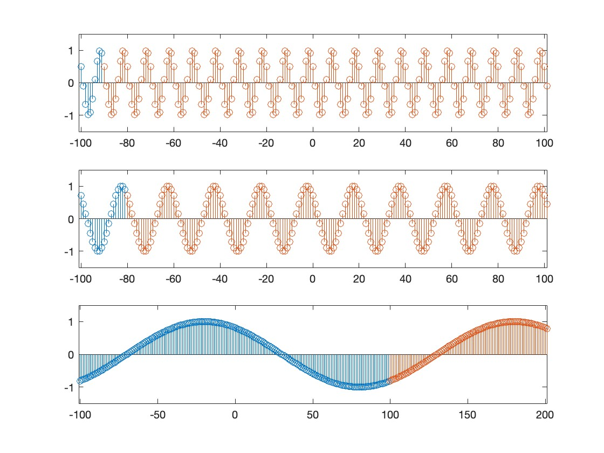
  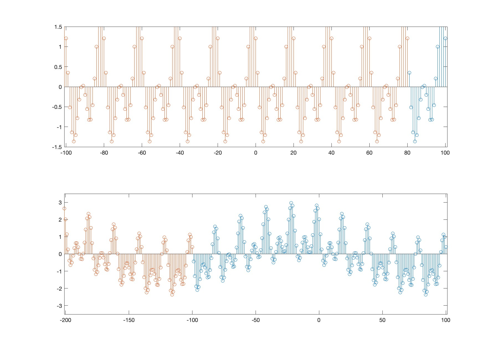
</p>

---
## Άσκηση 4 (ev_od.m)
Να γραφεί συνάρτηση (function) που να δέχεται σαν όρισμα σήμα διακριτού χρόνου και το χρονικό  διάστημα  στο  οποίο  ορίζεται  και να επιστρέφει  το  άρτιο  και  περιττό  μέρος  του σήματος, καθώς και το χρονικό άξονα στον οποίο ορίζονται. Τέλος η συνάρτηση να φτιάχνει τη  γραφική  παράσταση  των  δύο  σημάτων  εξόδου,  στο  σωστό  χρονικό  άξονα.  Π.χ. *[xe,xo,m]=ev\_od(x,n).*  

   Στη συνέχεια με χρήση της συνάρτησης,  να υπολογιστεί το άρτιο και περιττό μέρος της ακολουθίας του σήματος x[n] του ερωτήματος 2β. Να γίνουν οι γραφικές παραστάσεις.

<p align="center">
  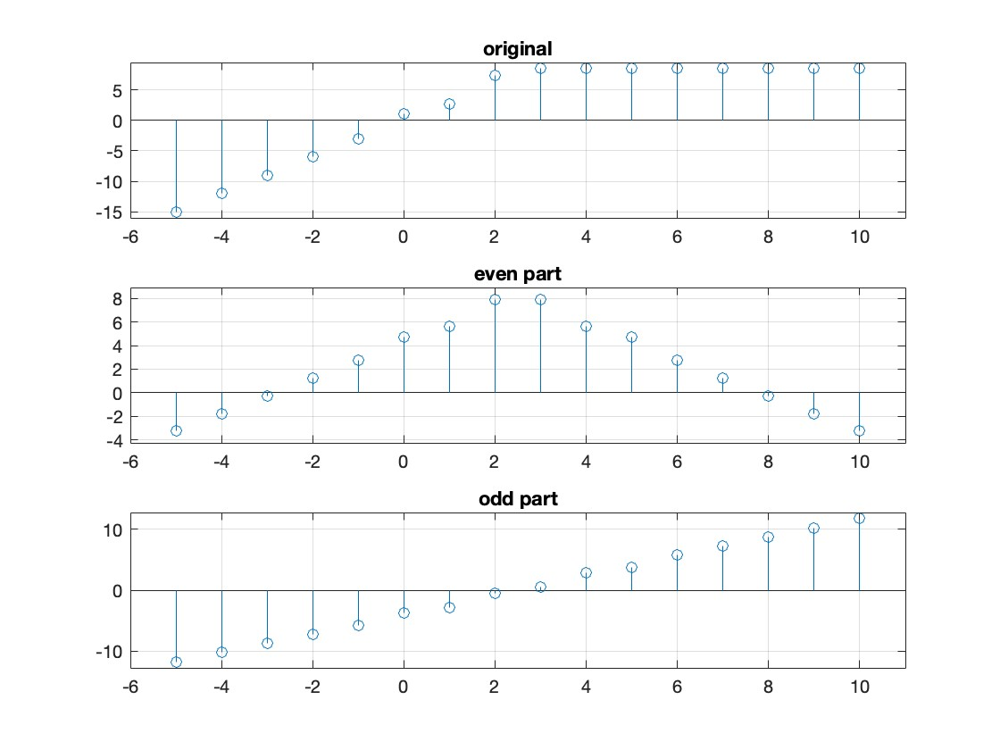
</p>

---
## Άσκηση 5
Θεωρήστε  σύστημα  διακριτού  χρόνου,  γραμμικό  χρονικά  αναλλοίωτο,  το  οποίο χαρακτηρίζεται από κρουστική απόκριση:

```math
h[n]=\sqrt{8|n|}(2\delta[n+4]+(u[n+1]-3u[n-2])).
```

```math
𝑥[𝑛]=4𝛿[𝑛+3]+2𝛿[𝑛]−𝛿[𝑛−1]+5𝛿[𝑛−3],
```

θέτωντας −12≤𝑛≤12.
Να γίνει η γραφική παράσταση των σημάτων της κρουστικής απόκρισης, της εισόδου και της εξόδου του συστήματος.

<p align="center">
  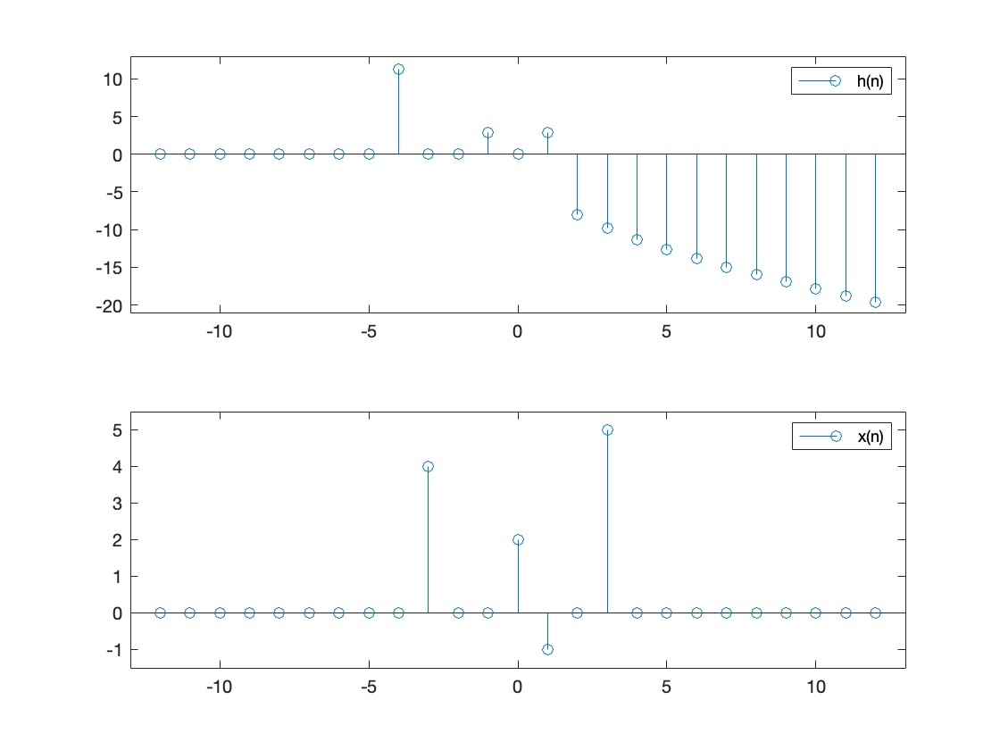
  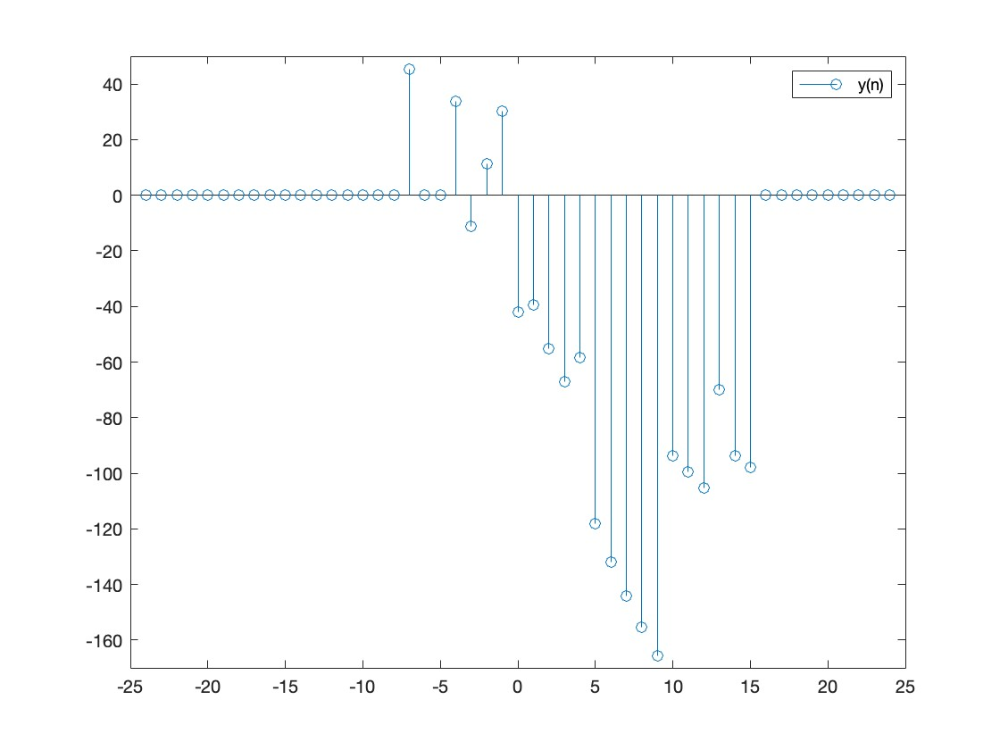
</p>

---
## Άσκηση 6 (convtoe.m)
Να γραφεί συνάρτηση η οποία να υλοποιεί τη συνέλιξη δύο ακολουθιών υπολογίζοντας τη
συνέλιξη ως γινόμενου διανυσματικού πίνακα Toeplitz επί διάνυσμα.

---
## Άσκηση 7
Με χρήση της συνάρτησης του ερωτήματος 6 να υπολογιστεί η συνέλιξη των ακολουθιών
z[n]=x[n]* y[n] όπου:

```math
𝑥[𝑛]=4𝛿[𝑛+1]+9𝛿[𝑛]−2𝛿[𝑛−2]
```

```math
y[n] = \frac{n}{6}(u(n+2) - u(n-3))
```

Να γίνει η γραφική παράσταση των z[n], x[n], y[n] στους κατάλληλους άξονες. Τέλος, να
επαληθευτεί το αποτέλεσμα με τη χρήση της conv().

<p align="center">
  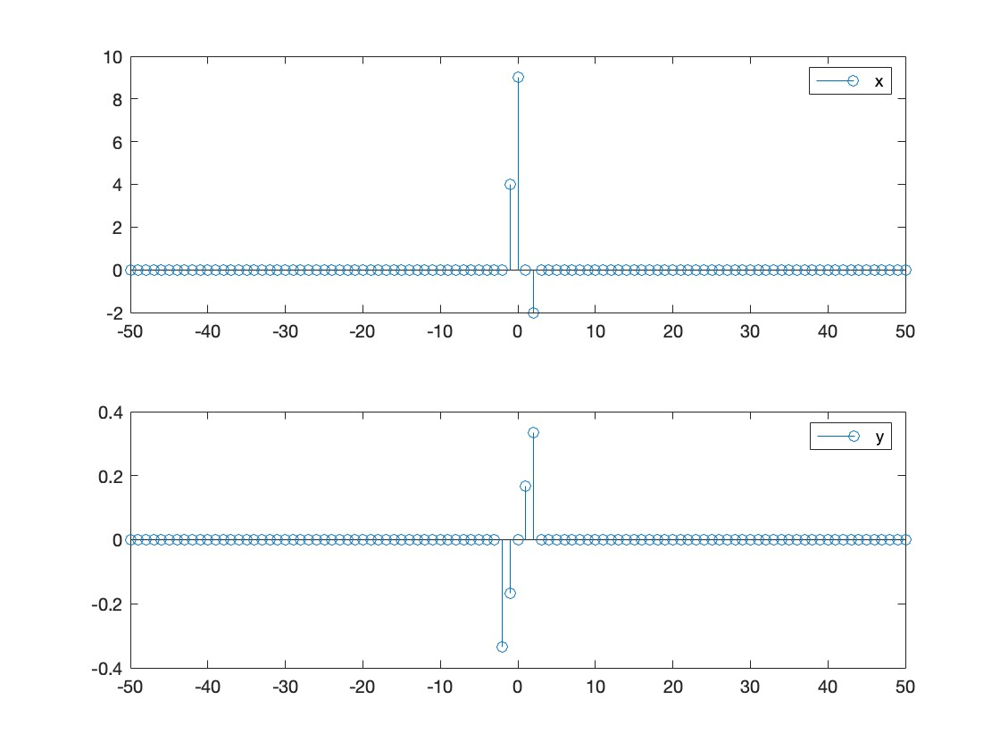
  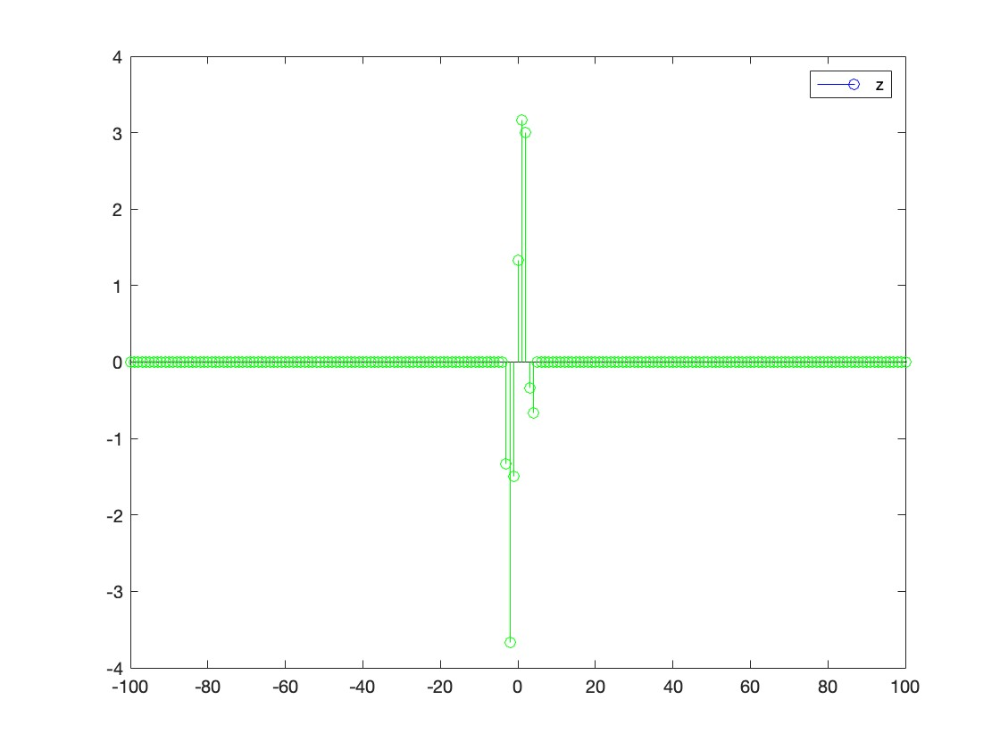
</p>
  
---
## Άσκηση 8
Ας θεωρηθεί το σύστημα που περιγράφεται από τη σχέση εισόδου εξόδου:

```math
𝑦[𝑛]=4𝑛^2*𝑥[𝑛]
```

Να διερευνηθεί με γραφικό τρόπο εάν το σύστημα είναι γραμμικό. Η διερεύνηση να γίνει στο
διάστημα `n = [-5 :10]` ενώ οι βοηθητικές είσοδοι είναι : `x1[n]=[ 2 2 3 3 4], 0 ≤ n ≤ 4,`
`x2[n]=u[n]-u[n-6]` και οι σταθερές : `α=4` και `β=5`. Σε υποπαράθυρα του ίδιου γραφικού
παραθύρου να σχεδιαστούν οι είσοδοι x1, x2 και οι δύο έξοδοι που σχετίζονται με τη
διερεύνηση της γραμμικότητας.

<p align="center">
  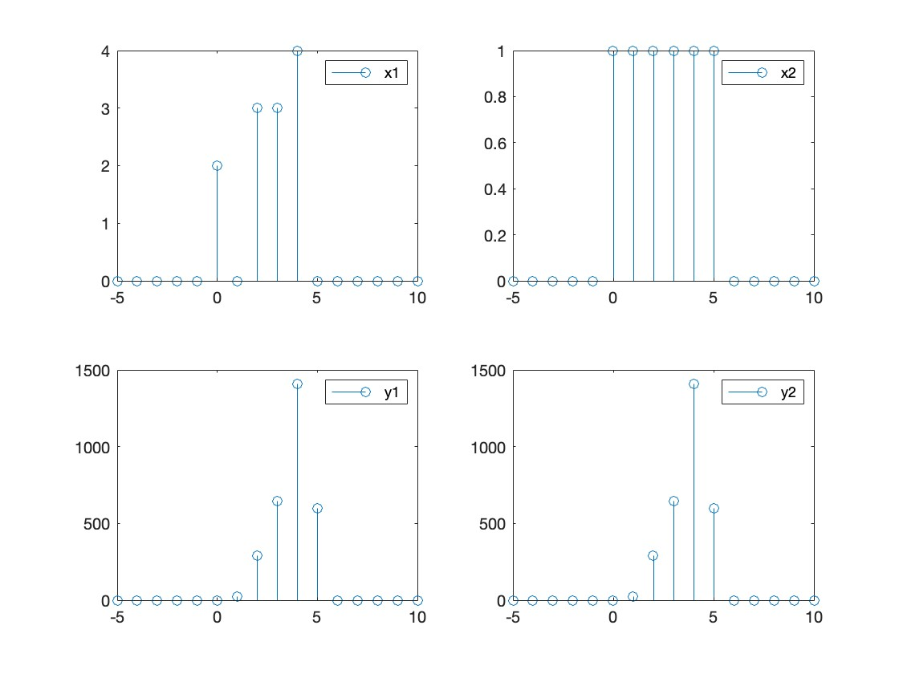
</p>

---
## Άσκηση 9
Δίνεται η εξίσωση διαφορών ενός συστήματος:

```math
𝑦[𝑛]+3𝑦[𝑛−1]−5𝑦[𝑛−2] = 0.5𝑥[𝑛]− 𝑥[𝑛−2]
```

α) Να υπολογιστεί και να γίνει η γραφική παράσταση της κρουστικής απόκρισης.
β) Απ’ αυτή τη γραφική παράσταση να εξηγήσετε αν το σύστημα είναι BIBO
ευσταθές ή όχι.
γ) Να υπολογιστεί η έξοδος για είσοδο την `x = [2 1 1 1 0 0 1 1 0 0 2]` χρησιμοποιώντας τη filter
και την conv και να εξηγήσετε αυτά που βλέπετε σε σχέση με αυτά που σχολιάσαμε στο
φυλλάδιο.
δ) Επαναλάβατε το ερώτημα (γ) για είσοδο `x[n] = 2cos(3π*n)`.

<p align="center">
  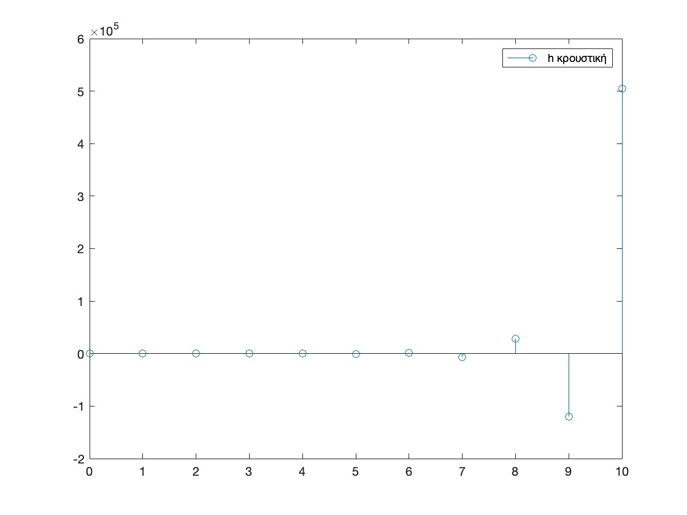
  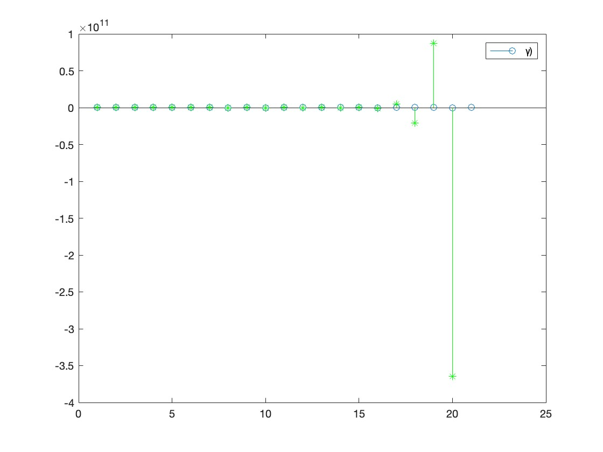
  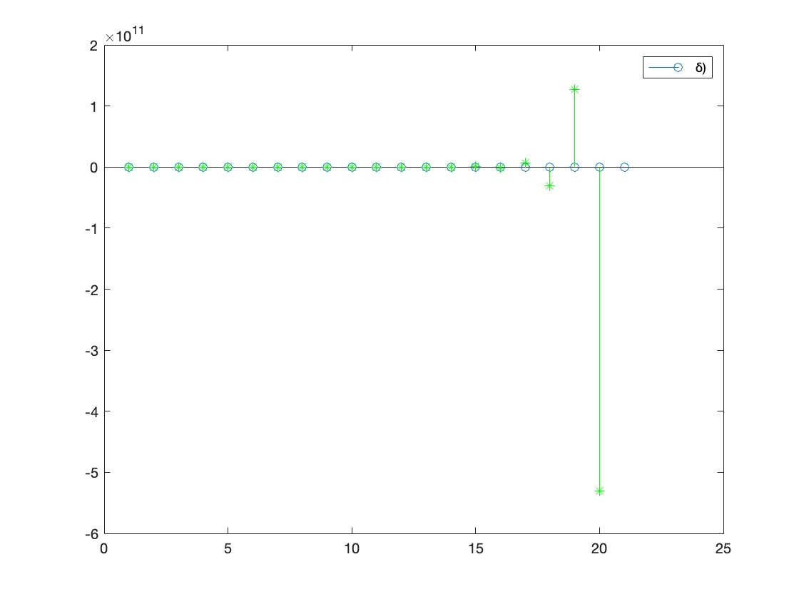
</p>

---
## Άσκηση 10
Δίνεται σύστημα που περιγράφεται από την ΕΔ

```math
𝑦[𝑛]=0.4𝑦[𝑛−1]+𝑥[𝑛]−0.7𝑥[𝑛−2]
```

a) Να βρεθεί και να σχεδιαστεί η έξοδος για χρόνο n=[-20 : 20] όταν η είσοδος είναι

```math
𝑥[𝑛]= 2𝛿[𝑛+1]+ 4𝛿[𝑛]+ 8𝛿[𝑛−1]+ 9𝛿[𝑛−2]
```

b) Να βρεθεί και να σχεδιαστεί για n=[-20 : 20] η κρουστική απόκριση του συστήματος
με χρήση της συνάρτησης impz (help impz για σύνταξη).

<p align="center">
  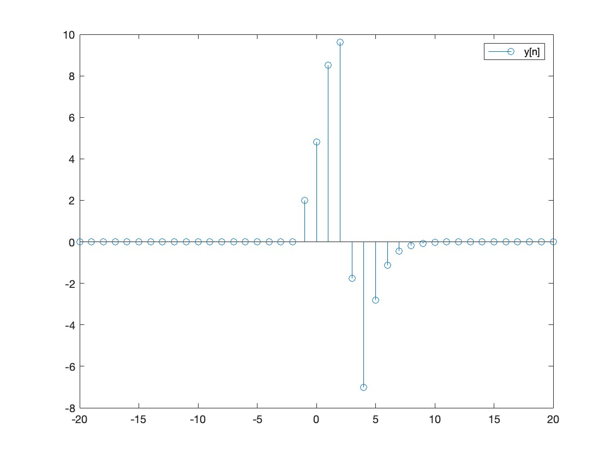
  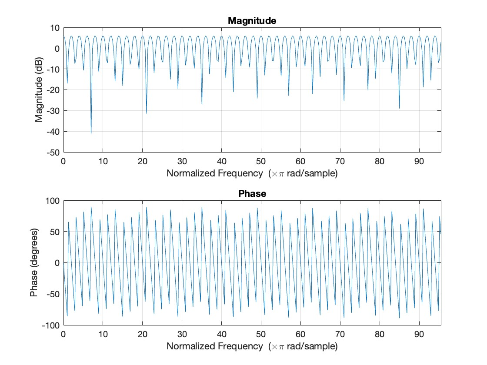
</p>
  
---
## Άσκηση 11
Σύστημα διακριτού χρόνου περιγράφεται από την εξίσωση διαφορών:

```math
y[n] = \frac{1}{4} \sum_{m=0}^{3} x[n-m]
```

Να βρεθεί η έξοδος του συστήματος όταν η είσοδός του είναι το σήμα

```math
x[n] = 2 \cos\left(\frac{\pi n}{8}\right) + w_n, \quad n = 0:40
```

Οπου w[n] είναι θόρυβος Gaussian που προστίθεται στο ημιτονοειδές σήμα (να
χρησιμοποιηθεί η συνάρτηση randn()).

Να γίνουν οι γραφικές παραστάσεις του αθόρυβου σήματος, του ενθόρυβου σήματος και της
εξόδου του συστήματος. Ποια πιστεύετε οτι είναι η δράση του συστήματος στο ενθόρυβο
σήμα?
Επαναλάβετε τη διαδικασία για το σύστημα 
```math
y[n] = \frac{1}{8} \sum_{m=0}^{7} x[n-m]
```
Συγκρίνετε τα δύο συστήματα.

<p align="center">
  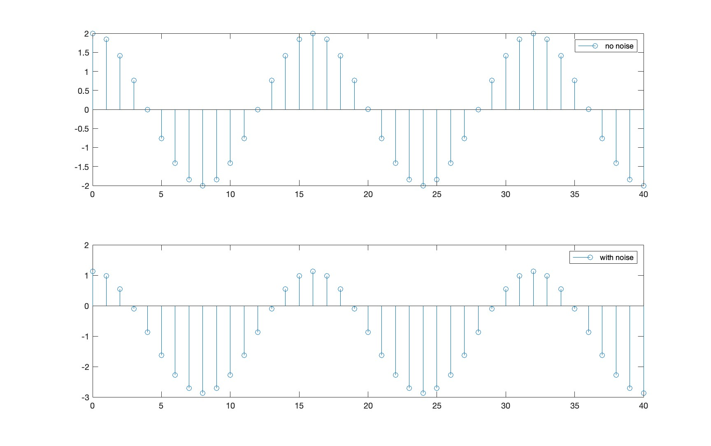
  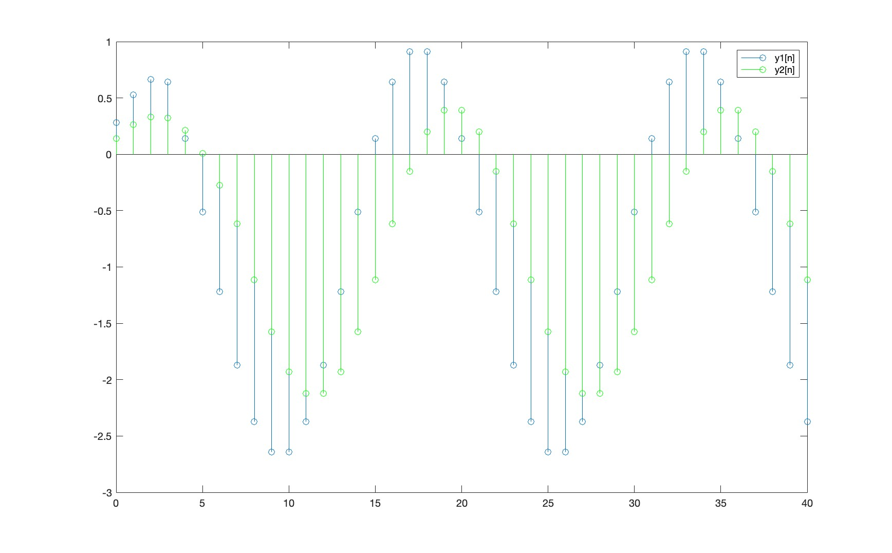
</p>

---
## Άσκηση 12
Δίνεται το σύστημα διακριτού χρόνου που περιγράφεται από την ακόλουθη εξίσωση
διαφορών:

```math
𝑦(𝑛)=3𝑥(𝑛+1)−𝑥(𝑛−3)
```

Να σχεδιαστεί η απόκρισή του στη μοναδιαία βηματική ακολουθία (βηματική απόκριση) στο
διάστημα −10≤𝑛≤10.

<p align="center">
  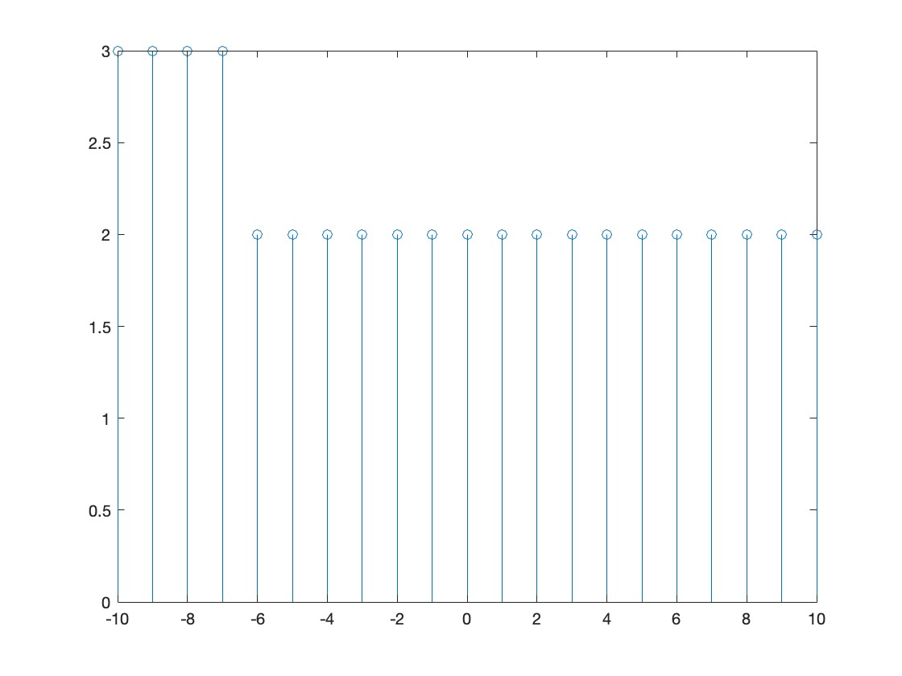
</p>

---
## Άσκηση 13
Να βρεθούν οι ακολουθίες που έχουν τους ακόλουθους μετασχηματισμούς Ζ, και στη
συνέχεια να υπολογιστούν οι 8 πρώτοι όροι τους

```math
X(z) = \frac{z}{z - \frac{1}{3}}
```

```math
Y(z) = \frac{z^2+1.6z}{(z + 0.8)(0.5z - 0.8)}
```

---
## Άσκηση 14
Με χρήση των συναρτήσεων poly() και residue() να αναλυθεί σε άθροισμα απλών
κλασμάτων η ρητή συνάρτηση :

```math
X(z) = \frac{z^2 + z + 1}{z(z + 0.4)(z + 0.5)}
```

---
## Άσκηση 15
Δίνεται σύστημα ΓΧΑ με κρουστική απόκριση $h(n)=0.9n u(n)$. Να βρεθεί η συνάρτηση
μεταφοράς του, να διερευνηθεί αν είναι ευσταθές, να γίνει το διάγραμμα πόλων μηδενικών.

<p align="center">
  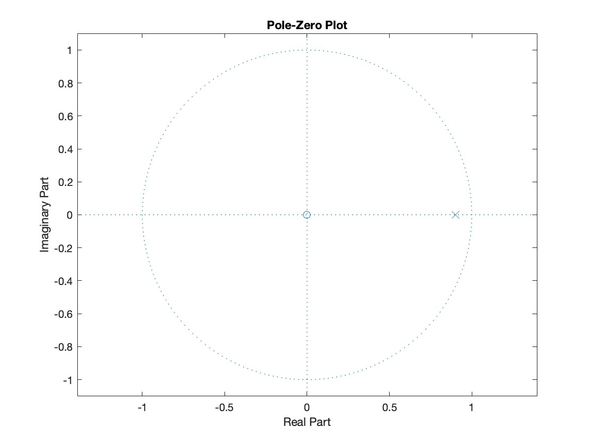
</p>

---
## Άσκηση 16
Nα βρεθεί η ΣΜ του συστήματος που περιγράφεται από την ΕΔ

```math
𝑦(𝑛)+0.3𝑦(𝑛−1)=𝑥(𝑛)+𝑥(𝑛−1)
```

με δύο τρόπους α) με χρήση tf() β) με χρήση solve(). Nα ελεγχθεί η ευστάθεια, να γίνει
διάγραμμα πόλων μηδενικών.

<p align="center">

  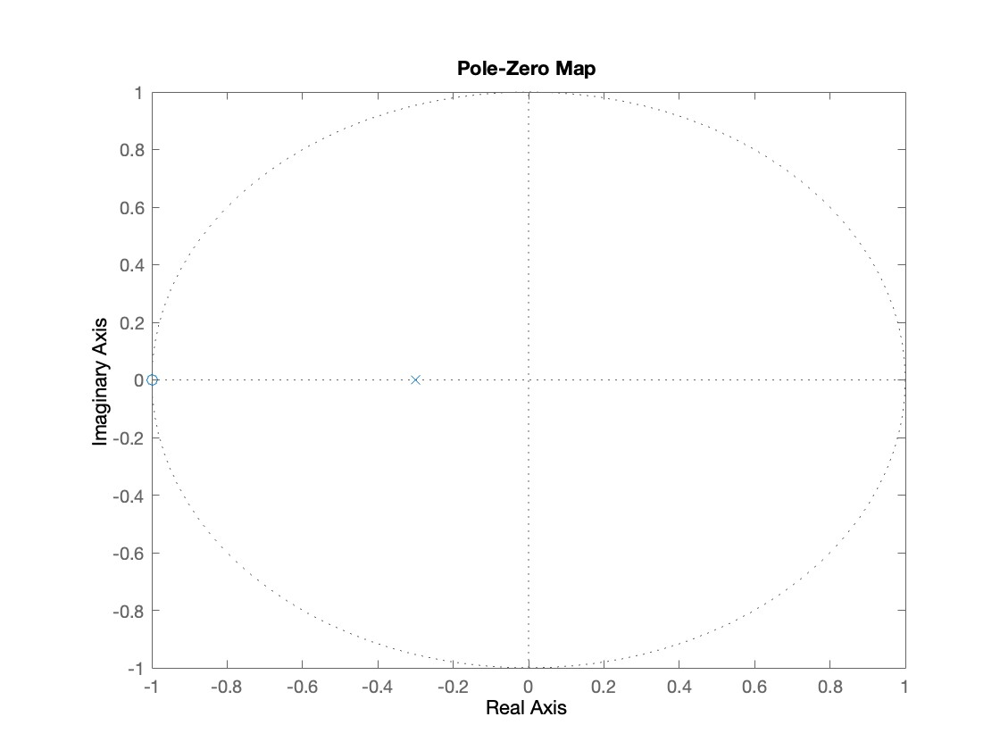
</p>

---
## Άσκηση 17
Να υπολογιστεί η συνάρτηση μεταφοράς και η κρουστική απόκριση του αιτιατού ΓΧΑ
συστήματος διακριτού χρόνου πρώτης τάξης, το οποίο περιγράφεται από την εξίσωση
διαφορών:

```math
𝑦(𝑛)−0.9𝑦(𝑛−1)=𝑥(𝑛)
```

Να γίνει το διάγραμμα πόλων μηδενικών και να προσδιοριστεί η ΠΣ.

<p align="center">

  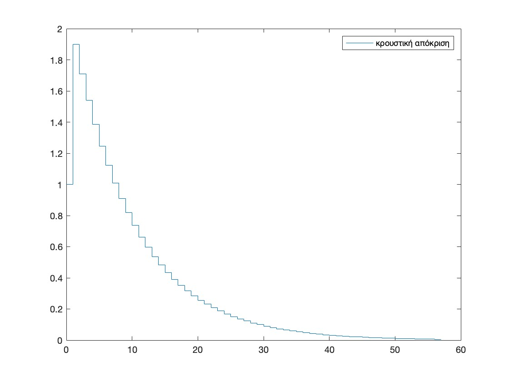
  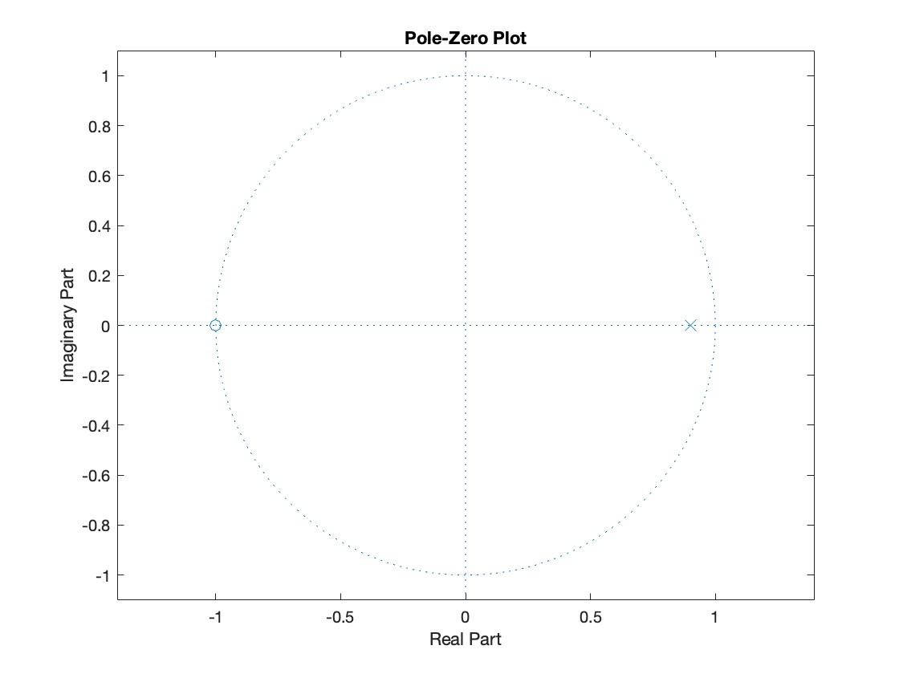
</p>
  
---
## Άσκηση 18
Δίνεται το αιτιατό ΓΧΑ σύστημα διακριτού χρόνου του οποίου η είσοδος και η έξοδος
συνδέονται από την εξίσωση διαφορών

```math
𝑦(𝑛)−0.5𝑦(𝑛−1)=𝑥(𝑛)
```

Να υπολογιστεί η έξοδος του συστήματος αν το σήμα εισόδου είναι x(n) = u(n) και το σύστημα
βρίσκεται σε ηρεμία.

<p align="center">
  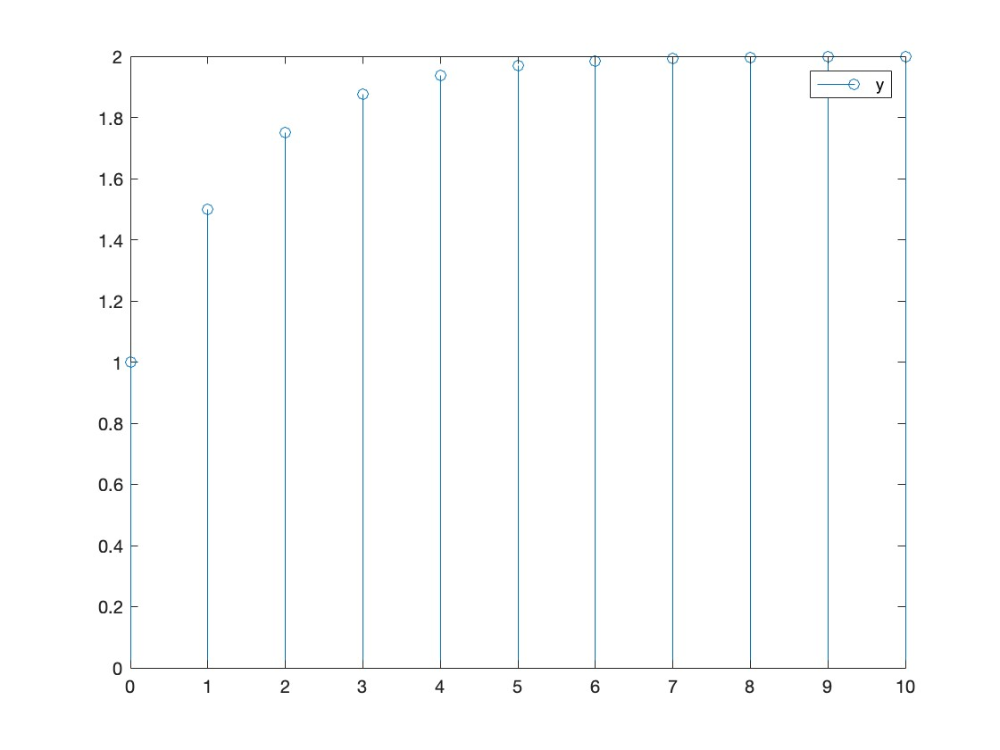
</p>


---
## Άσκηση 19
Δίνονται τα ΓΧΑ συστήματα S1, S2, S3 τα οποία είναι συνδεδεμένα μεταξύ τους όπως
φαίνεται στο σχήμα:
<p align="center">
  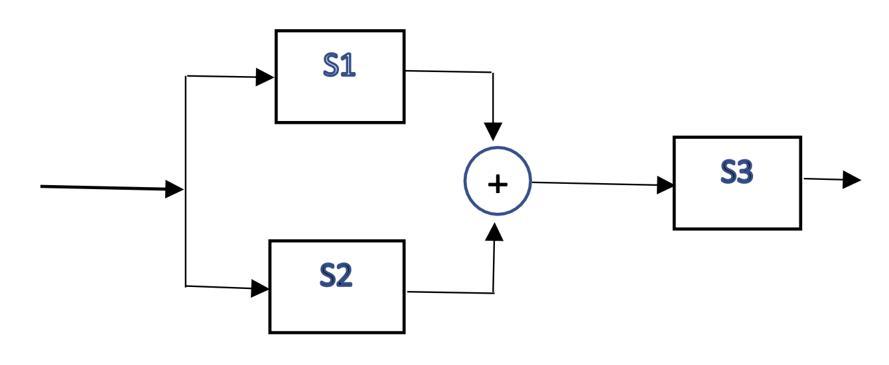
</p>

και περιγράφονται από τις εξισώσεις διαφορών:

```math
𝑆1: 2𝑦[𝑛]+𝑦[𝑛−1]+0.5𝑦[𝑛−2]=0.1𝑥[𝑛−1]+0.1𝑥[𝑛−3]
```

```math
𝑆2: 𝑦[𝑛]=2𝑥[𝑛]+𝑥[𝑛−2]
```

```math
𝑆3: 𝑦[𝑛]−0.5𝑦[𝑛−2]+0.8𝑦[𝑛−3]=𝑥[𝑛]+0.4𝑥[𝑛−1]−1.4𝑥[𝑛−2]
```

Να βρεθεί η συνολική κρουστική απόκριση της διάταξης με χρήση της impz().

<p align="center">
  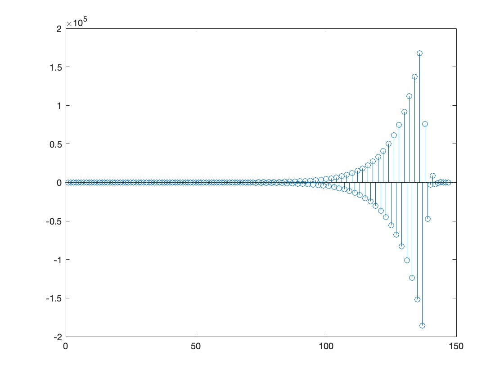
</p>

---
## Άσκηση 20
Σε σύστημα που χαρακτηρίζεται από την εξίσωση διαφορών:

```math
𝑦[𝑛]=𝑥[𝑛]+𝑥[𝑛−1]
```

εφαρμόζεται είσοδος $𝑥[𝑛] = 𝑢[𝑛]$. Να σχεδιαστεί η έξοδος $y[n]$ για $0≤𝑛≤300$. Με
χρήση της freqz() να αναπαρασταθεί η απόκριση συχνότητας του συστήματος.

<p align="center">
  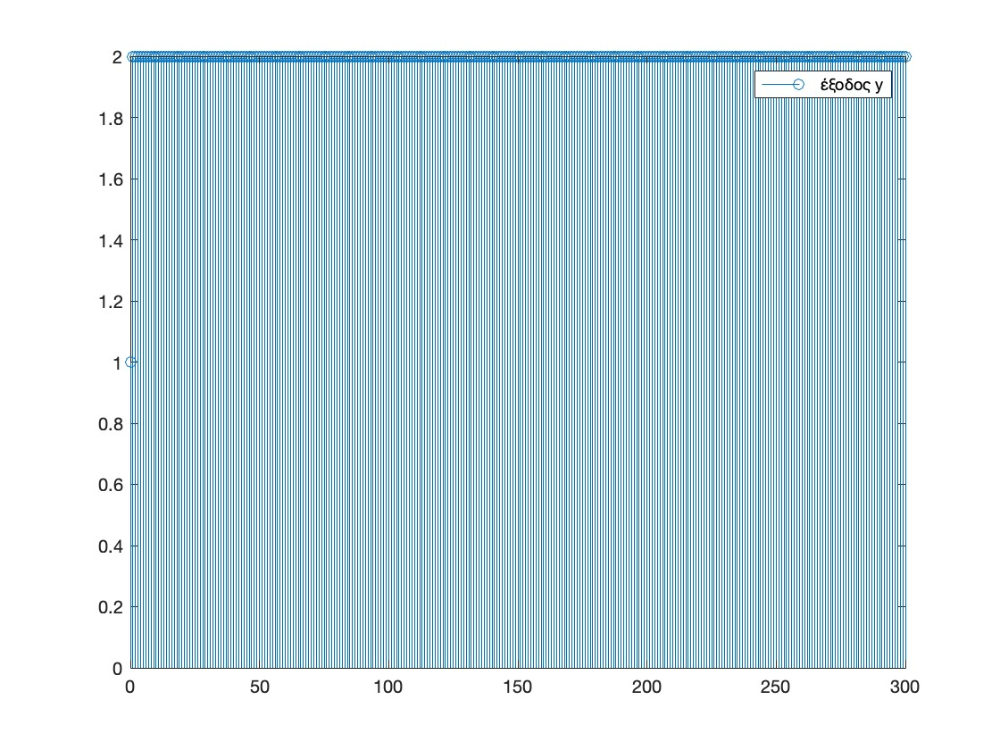
  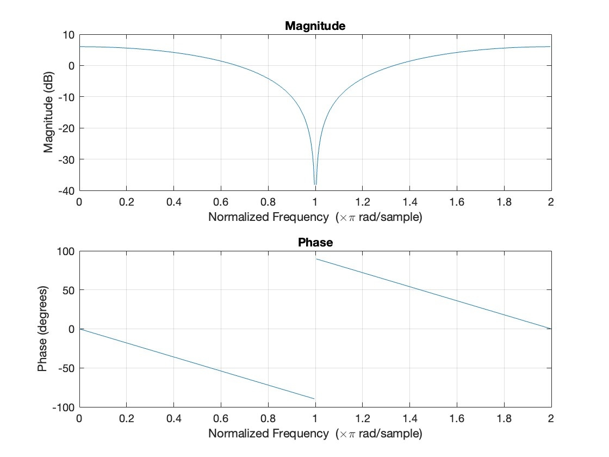
</p>

---
## Άσκηση 21
Όπως είναι γνωστό ο DFT μπορεί να θεωρηθεί ότι προέρχεται από τη δειγματολήπτιση
του DTFT πάνω στις συχνότητες $ω=2πk/N, k=0,…N-1$, δηλαδή σε Ν ισαπέχοντα σημεία
(συχνότητες) στο διάστημα 0 έως 2π (μία περίοδος). Οσο περισσότερα δείγματα παίρνουμε
τόσο πυκνώνουν οι γραμμές του διακριτού φάσματος.
Θεωρήστε το διακριτό σήμα $x[n]=n, n=0:15$ . Να σχεδιαστούν στο ίδιο σχήμα το μέτρο του
DTFT για $0≤ω≤2π$ και του DFT (με χρήση του αλγορίθμου fft) πάνω στις συχνότητες $ω=2πk/N,
k=0,…N-1$ όπου Ν=16.
Στο ίδιο σχήμα να σχεδιαστεί και το μέτρο του DFT του σήματος για Ν=32 σημεία.

<p align="center">
  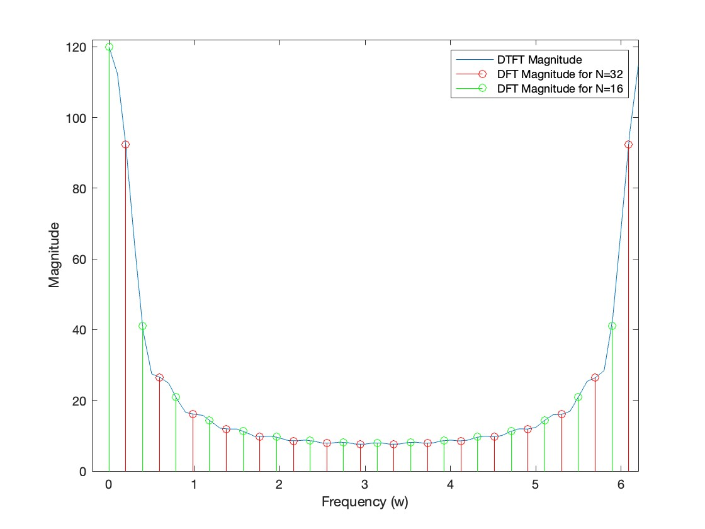
</p>

---
## Άσκηση 22
Από τους μετασχηματισμούς DFT που δημιουργήθηκαν στην προηγούμενη άσκηση να
γίνει αναπαραγωγή του αρχικού σήματος με χρήση της συνάρτησης ifft(). Να αναπαρασταθούν
σε 3 υποπαράθυρα ενός γραφικού παραρύρου τα δύο σήματα που προκύπτουν καθώς και το
αρχικό σήμα $x[n]$.

<p align="center">
  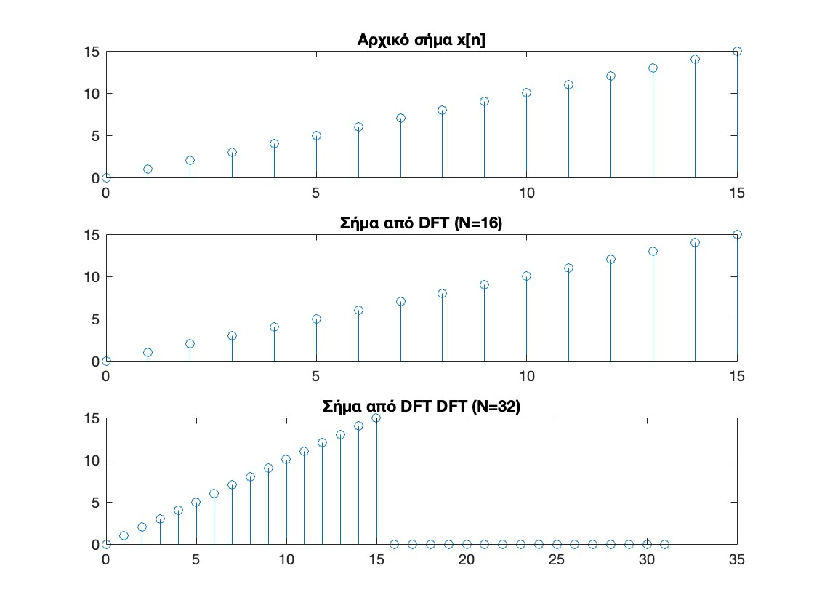
</p>

---
## Άσκηση 23
Ας θεωρηθεί το σήμα $𝑥[𝑛]=2𝑐𝑜𝑠(3𝜋𝑛/4), -10≤𝑛≤10$.
Να βρεθεί το φάσμα του σήματος αυτού με χρήση της fft σε 512 σημεία. Αναπαραστήστε το
φάσμα πλάτους σε γραφικό παράθυρο. Παρατηρήστε τη διασπορά συχνοτήτων σε εύρος
μεγαλύτερο από τις αναμενόμενες θεωρητικά φασματικές γραμμές του συνημιτόνου. Το
φαινόμενο αυτό οφείλεται στον περιορισμό της άπειρης διάρκειας του συνημιτόνου και
ονομάζεται φασματική διασπορά.
Επαλαβετε την ίδια διαδικασία για το σήμα x[n], θεωρώντας αυτή τη φορά $-40≤𝑛≤40$.
Σχολιάστε το φάσμα που προκύπτει.

<p align="center">
  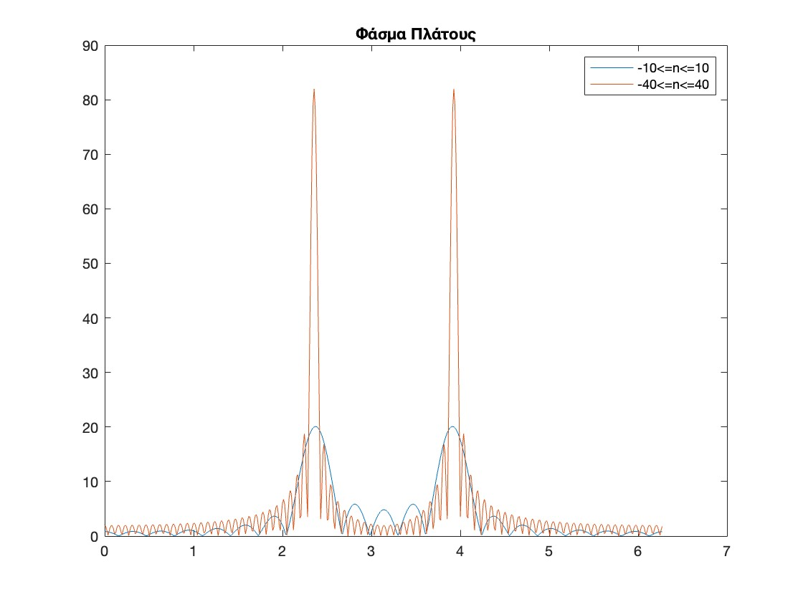
</p>

---
## Άσκηση 24 (linconv.m)
α) Να γραφεί συνάρτηση που υλοποιεί τη γραμμική συνέλιξη δύο ακολουθιών με χρήση
των συναρτήσεων fft(), ifft().
β) Με χρήση των συναρτήσεων tic & toc να συγκριθεί η ταχύτητα εύρεσης της συνέλιξης ενός
σήματος, x, με τον εαυτό του, όταν η συνέλιξη υπολογίζεται α) με την conv και β) με χρήση
fft(), ifft(). Για το σκοπό αυτό να δημιουργηθεί ένας επαναληπτικός βρόχος, σε κάθε
επανάληψη του οποίου, η ακολουθία x, θα αποτελείται από 1000 ως 100000 μονάδες, με βήμα
1000. Να γίνει γραφική παράσταση των χρόνων εκτέλεσης της συνέλιξης από τις δύο
μεθόδους.

<p align="center">
  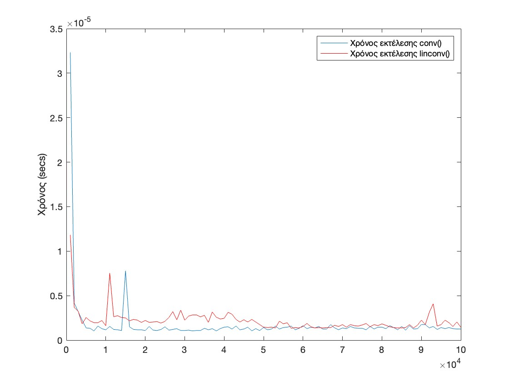
</p>

---
## Άσκηση 25
Να υπολογιστεί μέσω της συνάρτησης συνέλιξης του ερωτήματος 24α, η γραμμική
συνέλιξη των $𝑥[𝑛]=(𝑛+1)∗(𝑢[𝑛]−𝑢[𝑛−4]), 𝑦[𝑛]=𝑢[𝑛]−𝑢[𝑛−7], 0≤𝑛≤6$. Να
γίνει επιβεβαίωση του αποτελέσματος με χρήση της conv().

<p align="center">
  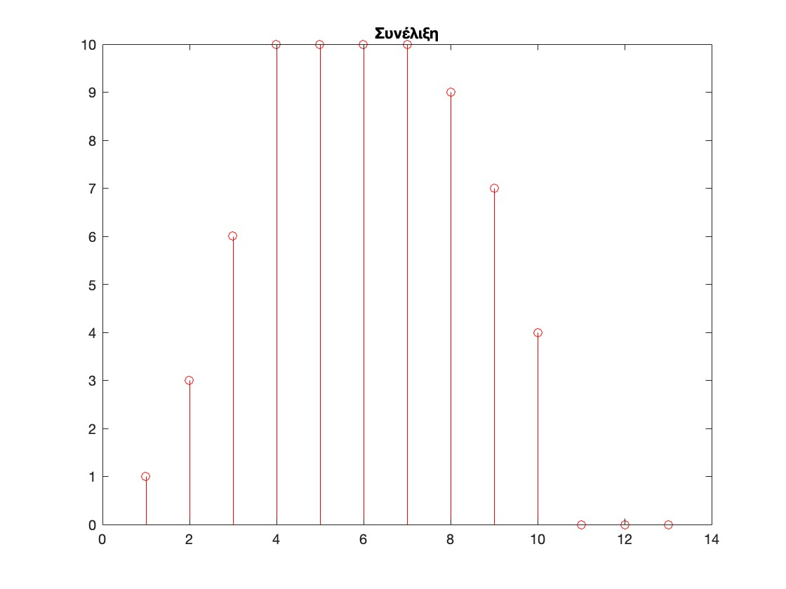
</p>

---
## Άσκηση 26
Δίνονται οι ακολουθίες $x[n]=δ[n]-2δ[n-2]+4δ[n-5]$ και $w[n] =[1, 1,2,
-1 ], 0≤n≤3$
Να υπολογιστεί η κυκλική τους συνέλιξη α) στο πεδίο του χρόνου β) με χρήση fft(), ifft().

<p align="center">
  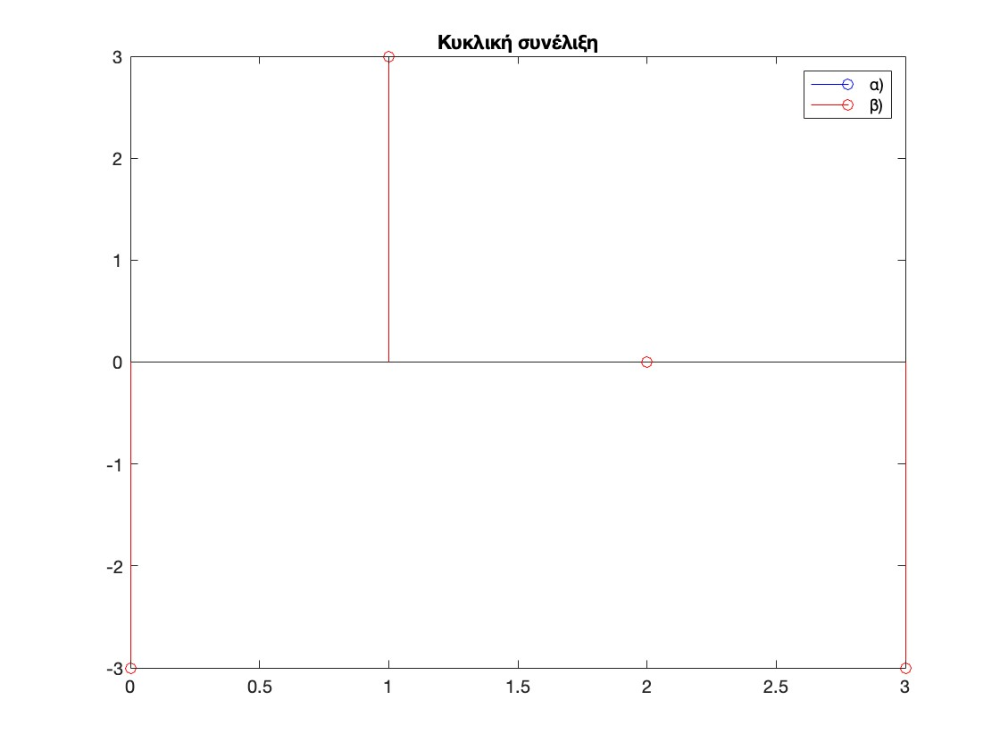
</p>

---
## Άσκηση 27
*Για τις δύο ακολουθίες της προηγούμενης άσκησης:*
α) Nα υπολογιστεί η κυκλική συνέλιξη 8 σημείων
β) Να βρεθεί η γραμμική συνέλιξη α) στο πεδίο του χρόνου β) με χρήση fft(), ifft()

<p align="center">
  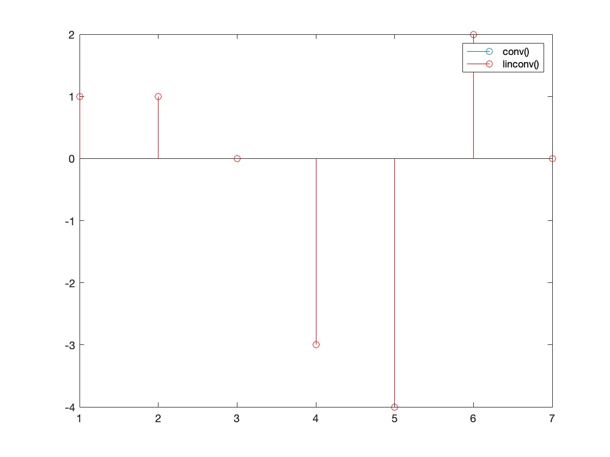
</p>

---
## Άσκηση 28
Να υπολογιστεί η ενέργεια του σήματος $x[n]=1.01n, 0≤n≤100$, α) στο πεδίο του διακριτού
χρόνου β) από τους συντελεστές της ακολουθίας DFT.
Θεώρημα Parseval για DFT : 

```math
E =\sum_{n=0}^{N-1} |x[n]|^2 = \frac{1}{N} \sum_{k=0}^{N-1} |X[k]|^2
```

---
## Άσκηση 29
Να υπολογιστεί η ισχύς της μοναδιαίας βηματικής ακολουθίας:

```math
𝑢[𝑛], 𝛾𝜄𝛼 −5000 ≤ 𝑛 ≤ 5000
```

Συγκρίνετε το αποτέλεσμα που βρήκατε με το αποτέλεσμα από τη θεωρητική επίλυση.

---
## Άσκηση 30
Η ιδιότητα της γραμμικότητας για το DTFT εκφράζεται από την ακόλουθη σχέση

```math
{\alpha x_1[n] + \beta x_2[n]} \stackrel{\text{DTFT}}\longleftrightarrow \alpha X_1(e^{j\omega}) + \beta X_2(e^{j\omega})
```

Να γραφτεί πρόγραμμα που θα διαπιστώνει την ισχύ της ιδιότητας, θέτωντας $x1[n], x2[n]$ δύο
ψευδοτυχαίες ακολουθίες μήκους 21 και $α=4, β=5$ και $0 ≤ n ≤ 20$.
