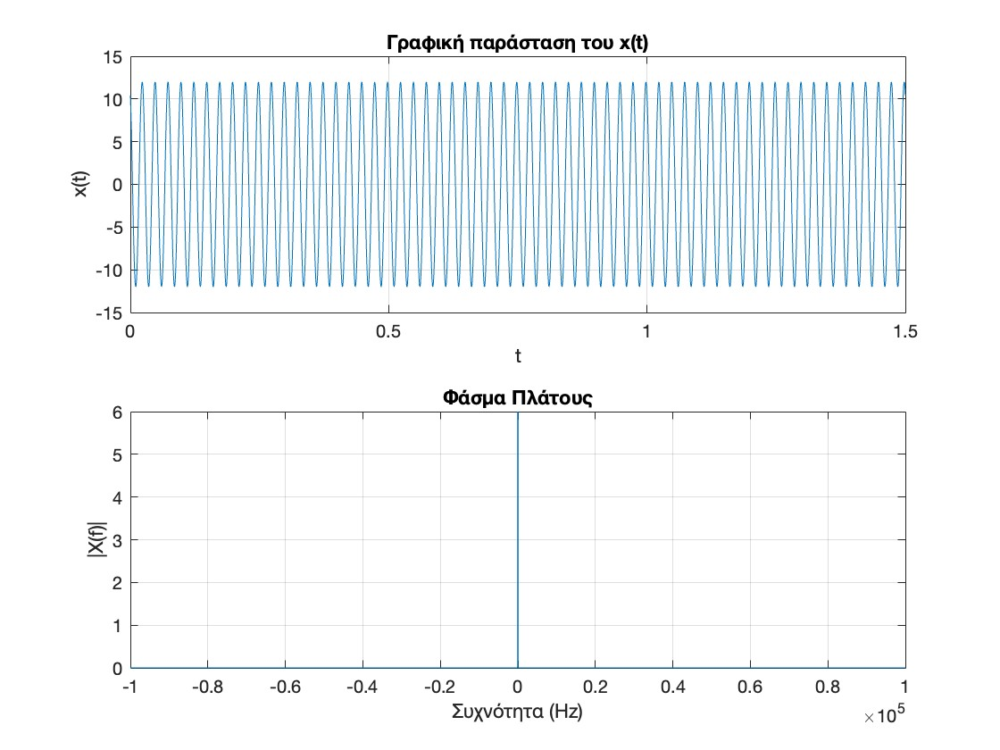
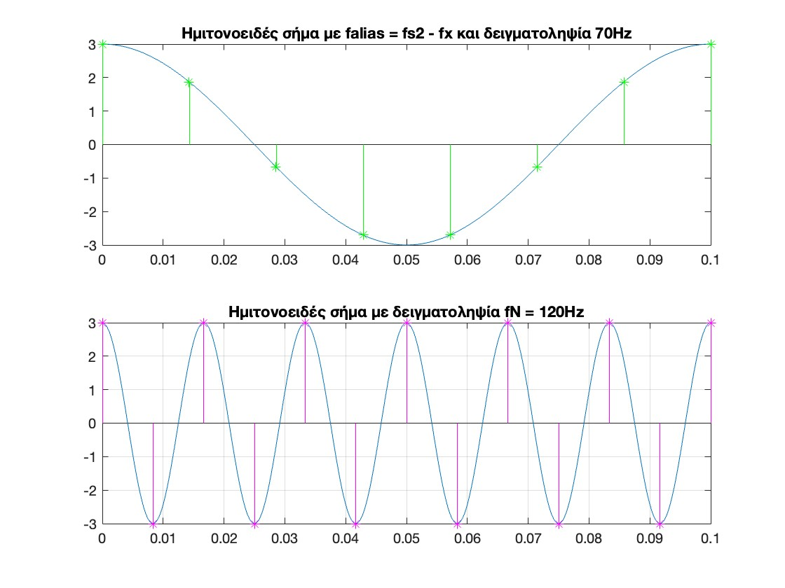
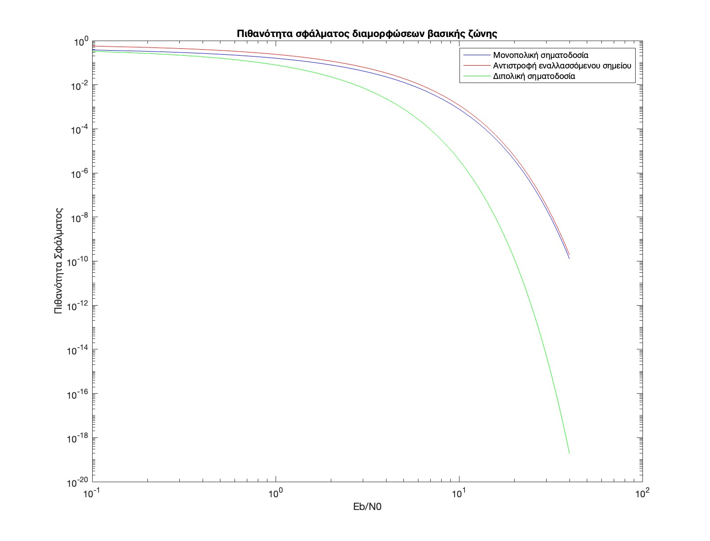
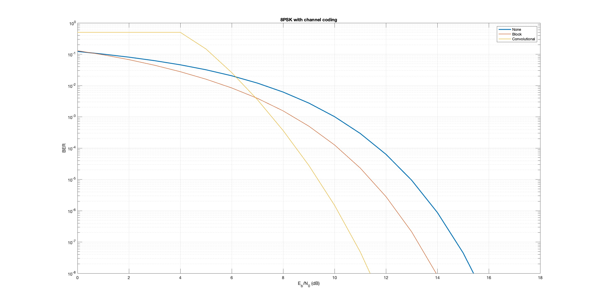

# Ασκήσεις
---
## Άσκηση 1
Η συνάρτηση sinc (sine cardinal) ονομάζεται και συνάρτηση δειγματοληψίας και δίνεται από τη σχέση:
`sinc(x)=sin⁡(πx)/πx`

Η μετατροπή ενός ψηφιακού σήματος σε αναλογικό, µπορεί να υλοποιηθεί µε ένα ψηφιακό φίλτρο που έχει ως κρουστική απόκριση τη συνάρτηση sinc. 
Να δημιουργηθεί το σήμα που δίνεται από την ακόλουθη σχέση:
`x(t)=sinc(1000t)`
Σε 3 γραφικά υποπαράθυρα του ίδιου γραφικού παραθύρου να απεικονιστούν τα ακόλουθα:

α) η γραφική αναπαράσταση του σήματος, στο πεδίο του χρόνου, από -0.05 ως 0.05 sec με βήμα δειγματοληψίας dt=0.0001. Σε ποια χρονική στιγμή συμβαίνει ο πρώτος μηδενισμός του σήματος? 
β) το φάσμα πλάτους του σήματος. Ποιο είναι θεωρητικά το εύρος του φάσματος πλάτους του σήματος. 
γ) το φάσμα φάσης του σήματος.
Να δημιουργηθεί το σήμα x1(t) που αποτελεί τη μετατόπιση του σήματος x(t) έτσι ώστε το κέντρο του παλμού sinc να τοποθετείται τη χρονική στιγµή t = 0.01s. Σε νέο γραφικό παράθυρο, και στα 3 γραφικά υποπαράθυρά του να απεικονιστούν τα ακόλουθα: 
δ) Να γίνει η γραφική απεικόνιση του σήματος x1(t) στο πεδίο του χρόνου. 
ε) το φάσμα πλάτους του σήματος x1(t). 
ζ) το φάσμα φάσης του σήματος x1(t).

  
  

---
## Άσκηση 2
Να δημιουργηθεί το σήμα που δίνεται από την ακόλουθη σχέση:
`x(t)=sinc(2000t)`

Σε τρία γραφικά υποπαράθυρα του ίδιου γραφικού παραθύρου να απεικονιστούν τα ακόλουθα: 

α) η γραφική αναπαράσταση του σήματος, στο πεδίο του χρόνου, από -0.05 ως 0.05 sec με βήμα δειγματοληψίας dt=0.0001. Σε ποια χρονική στιγμή συμβαίνει ο πρώτος μηδενισμός του σήματος? 
β) το φάσμα πλάτους του σήματος. 
γ) το φάσμα φάσης του σήματος. 

Να συγκριθεί το φάσμα του σήματος με το φάσμα του σήματος της άσκησης 1.

  

---
## Άσκηση 3
Να δημιουργηθεί το ακόλουθο σήμα που αποτελείται από την υπέρθεση 3 ημιτονοειδών σημάτων συχνοτήτων 2, 4 και 6 Hz αντίστοιχα. 
`x(t) = 3cos⁡(4πt) + 2cos⁡(4πt) + sin⁡(12πt)`

Η συχνότητα δειγματοληψίας να είναι 80 Hz και η διάρκεια του σήματος 0.8sec. Να δημιουργηθεί η γραφική παράσταση του σήματος στο πεδίο του χρόνου.

Στη συνέχεια να γίνει η γραφική παράσταση του φάσματος πλάτους του σήματος. Παρατηρήστε οτι λόγω της χαμηλής ανάλυσης συχνότητας (frequency resolution) η απεικόνιση των 3 (κοντινών) συχνοτήτων δεν είναι ακριβής. Για το λόγο αυτό αυξήστε το πλήθος των σημείων στο οποίο υπολογίζεται ο fft. Το πλήθος των σημείων του fft (και του άξονα f) να βρεθεί από την εντολή:

`Nf=2^ceil(log2(N))`
Όπου Ν το πλήθος των σημείων του άξονα t. 
Απεικονίστε ξανά το φάσμα πλάτους του σήματος. Ποια είναι η ανάλυση συχνοτήτων στην περίπτωση αυτή? (Ανάλυση συχνοτήτων Fourier =Fs/number of fft points.

  

    

---
## Άσκηση 4
Να δημιουργηθεί παλμός Gaussian μορφής που δίνεται από την ακόλουθη σχέση
\[ g(t) = \frac{1}{\sigma \sqrt{2\pi}} \exp\left(-\frac{t^2}{2\sigma^2}\right) \]
Όπου σ είναι η τυπική απόκλιση (standard deviation) του παλμού. Ας θεωρηθεί σ=0.1, συχνότητα δειγματοληψίας, Fs= 100Hz. Να δημιουργηθεί η γραφική παράσταση του σήματος στο πεδίο του χρόνου, για -0.5≤ t ≤0.5. Να βρεθεί το φάσμα του σήματος με χρήση fft και το πλήθος των σημείων, m,του fft (και του άξονα f) να είναι δύναμη του 2 (χρησιμοποιήστε κατάλληλα την εντολή nextpow2). 

Ποιοείναι το m, και γιατί πρέπει να είναι δύναμη του ? Nα γίνει η γραφική παράσταση του φάσματος πλάτους του σήματος.

  

---
## Άσκηση 5
Να δημιουργηθεί ημίτονο συχνότητας 40 Hz με συχνότητα δειγματοληψίας 2KHz, το πλάτος και η φάση του ημιτόνου να είναι 12 Volt και 2π/3 αντίστοιχα και η χρονική διάρκεια 1.5 sec. Να γίνει η γραφική παράσταση του ημιτόνου, να βρεθεί το φάσμα του και να γίνει και η γραφική παράσταση του φάσματος πλάτους. Συγκρίνετε το φάσμα πλάτους που απεικονίζεται στη γραφική παράσταση με τη θεωρητική έκφραση του φάσματος πλάτους του ημιτόνου.

  

---
## Άσκηση 6
Θεωρήστε σήμα πληροφορίας που δίνεται από την ακόλουθη σχέση: 
`s(t)=Am * sin⁡(2πfmt)` με Αm=0.5 Volt,fm=2 Hz.

Το σήμα αυτό διαμορφώνει κατά ΑΜ ένα φέρον με τις εξής παραμέτρους: Ac =1 Volt, fc=100Hz. Θεωρήστε ότι t=[0:0.001:1]. Αναπαραστήστε γραφικά το σήμα πληροφορίας, το φέρον και το διαμορφωμένο σήμα. Αναπαραστήστε γραφικά επίσης, στην ίδια γραφική παράσταση με το διαμορφωμένο σήμα, και την περιβάλλουσα (envelope) του σήματος.

  

---
## Άσκηση 7
Εκτελέστε το ίδιο πείραμα με αυτό της άσκησης 6, αλλάζοντας μόνο το πλάτος του σήματος πληροφορίας σε : α)1Volt και β) 2Volt. Δημιουργήστε τις ίδιες γραφικές παραστάσεις με αυτές της άσκησης 6. Σχολιάστε τα γραφήματα, σε ποια περίπτωση αντιστοιχούν?

  
  

  
---
## Άσκηση 8
Κατεβάστε και αποθηκεύστε το σήμα ομιλίας 3WORDS.WAV που θα βρείτε στο https://booksite.elsevier.com/9780080993881/ (κατάλογος data). Διαβάστε το σήμα με τη συνάρτηση audioread και αποθηκεύστε το σε ένα διάνυσμα. Ακούστε το σήμα με χρήση της συνάρτησης sound. Να γίνει η γραφική παράσταση της κυματομορφής του σήματος συναρτήσει του χρόνου, και να αναπαρασταθεί το φάσμα πλάτους του σήματος. Αποθηκεύστε σε νέο διάνυσμα (x2) μόνο τα πρώτα 50000 δείγματα του σήματος ομιλίας και ακούστε το νέο σήμα. Τι παρατηρείτε? 

Στη συνέχεια θεωρήστε φέρον σήμα πλάτους Ac=1Volt και συχνότητας fc=100ΚΗz. Διαμορφώστε κατά DSB το φέρον με το σήμα ομιλίας (x2). Να γίνει η γραφική παράσταση του διαμορφωμένου σήματος.

 Να γίνει σύμφωνη αποδιαμόρφωση του σήματος, με χρήση τοπικού ταλαντωτή, σύμφωνου με το φέρον σήμα του πομπού και στη συνέχεια να περαστεί το σήμα από χαμηλοπερατό φίλτρο butterworth_filter(in, dt, order, fcut, fcenter), με χρήση του αντίστοιχου αρχείου στα έγγραφα του μαθήματος στο eclass (επιλέξτε τις κατάλληλες παραμέτρους). Να γίνει η γραφική παράσταση του αποδιαμορφωμένου. 

Ακούστε το αποδιαμορφωμένο σήμα. Ακούγεται ευκρινώς η λέξη?

  

---
## Άσκηση 9
Να επαναλάβετε τη διαδικασία της αποδιαμόρφωσης του σήματος της προηγούμενης άσκησης, για ένα μη ιδανικό τοπικό ταλαντωτή με κάποια μικρή διαφορά φάσης από το φέρον σήμα (π.χ. 0.1π). Στη συνέχεια να περαστεί το σήμα από χαμηλοπερατό φίλτρο butterworth_filter. Να γίνει η γραφική παράσταση του αποδιαμορφωμένου. Ακούστε πάλι το τελικό σήμα. Είναι αντιληπτό το σήμα ομιλίας? 

  

---
## Άσκηση 10
Στο ίδιο πείραμα που περιγράφεται στηνν άσκηση 8, να επαναληφθεί η διαδικασία αποδιαμόρφωσης και φιλτραρίσματος, αυτή τη φορά όμως, η διαφορά φάσης του τοπικού ταλαντωτή να είναι μεταβλητή:
`Δφ(t)=0.9π*rand(t)`

Να γίνει η γραφική παράσταση του αποδιαμορφωμένου.
Ακούστε πάλι το τελικό σήμα. Είναι αντιληπτό το σήμα ομιλίας? Συγκρίνετε τις τρεις περιπτώσεις (άσκηση 8,9,10) και σχολιάστε.

  

  
---
## Άσκηση 11
Δημιουργήστε ημιτονοειδές σήμα 60Hz, πλάτους 3V, διάρκειας 0.1 sec. Να δειγματοληπτηθεί το σήμα με 400Hz και έπειτα με 70Hz. Να αναπαρασταθούν και τα δύο σήματα στο ίδιο γράφημα. Είναι επαρκή τα δείγματα και στις δύο περιπτώσεις για την αναπαράσταση του σήματος? Παρατηρείτε φαινόμενο aliasing? 

Δημιουργήστε ένα συνημίτονο τέτοιας συχνότητας που να «περνάει» ακριβώς από τα δείγματα του δειγματοληπτημένου σήματος με συχνότητα δειγματοληψίας 70Hz. Εξηγήστε θεωρητικά την επιλογή σας. 

Τέλος δειγματοληπτήστε ακριβώς με τη συχνότητα Nyquist. Αναπαραστήστε γραφικά το δειγματοληπτημένο σήμα. Πόσα δείγματα λαμβάνονται ανά μία περίοδο?

  
  

---
## Άσκηση 12
Με χρήση της εντολής load κατεβάστε το αρχείο handel.mat που περιέχει σήμα με ένα απόσπασμα από το Hallelujah Chorus του Handel. Ακούστε το σήμα. Ποια είναι η συχνότητα δειγματοληψίας ? 
Αναπαραστήστε γραφικά το σήμα. Στη συνέχεια υποδειγματοληπτήστε κατά 2, δηλαδή, μειώστε τη συχνότητα δειγματοληψίας στο μισό. Αναπαραστήστε γραφικά το σήμα. Ακούστε πάλι το σήμα υπάρχει αλλοίωση στο μουσικό κομμάτι? Γιατί?

  

---
## Άσκηση 13
Να δημιουργηθεί το ακόλουθο σήμα διάρκειας 0.02sec και με συχνότητα δειγματοληψίας 1.2KHz,
`x(t)=2 sin⁡(200πt)+5cos⁡(100πt)`

Να κβαντιστεί σε 4 επίπεδα κβάντισης. Να γίνουν στο ίδιο γραφικό παράθυρο (hold on) οι γραφικές παραστάσεις του αρχικού σήματος, του κβαντισμένου, των ορίων των ζωνών κβάντισης, των επιπέδων κβάντισης και του σφάλματος κβάντισης.

Στη συνέχεια να φτιαχτεί απλός κωδικοποιητής των κβαντισμένων τιμών του σήματος σε δυαδικές ακολουθίες. Στη γραφική αναπαράσταση του σήματος να προστεθούν και οι κωδικές λέξεις που αντιστοιχούν σε κάθε κβαντισμένη τιμή του σήματος

  

---
## Άσκηση 14
Ένα σήμα λευκού θορύβου αποτελείται από ένα σύνολο ανεξάρτητων και ομοιόμορφα κατανεμημένων τυχαίων μεταβλητών (independent and identically distributed (i.i.d)). Στη διακριτή περίπτωση το σήμα λευκού θορύβου αποτελείται από μία ακολουθία δειγμάτων που είναι ανεξάρτητα και παράγονται από την ίδια κατανομή πιθανότητας (π.χ. ομοιόμορφη ή Gaussian).

Λευκός Gaussian θόρυβος μπορεί να παραχθεί στο Matlab με τη συνάρτηση randn. Για παράδειγμα με τις παρακάτω εντολές παράγεται Λευκός Gaussian θόρυβος (μήκους 30 δειγμάτων) με μηδενική μέση τιμή και τυπική απόκλιση σ=1.
`mu=0;sigma=1; `
`noise= sigma *randn(1,30)+mu`

Η φασματική πυκνότητα ισχύος Power Spectral Density function (PSD) δείχνει την ποσότητα ισχύος που περιέχεται ανά μονάδα φάσματος. Η φασματική πυκνότητα ισχύος μίας τυχαίας διαδικασίας μπορεί να υπολογιστεί από το μετασχηματισμό Fourier της συνάρτησης αυτοσυσχέτισής της. Θεωρείται ότι η τιμή της είναι σταθερή για όλο το φάσμα συχνοτήτων και ίση με τη διακύμανση της ισχύος του σήματος θορύβου.

Ενας απλός εκτιμητής της psd είναι το περιοδόγραμμα (periodogram). Συνίσταται στο να ληφθεί ο DTFT των δειγμάτων του σήματος και μετά να υψωθεί στο τετράγωνο το μέτρο του αποτελέσματος. Μπορεί να χρησιμοποιηθεί η συνάρτηση periodogram του Matlab για να υπολογιστεί και σχεδιαστεί το περιοδόγραμμα.
Δημιουργήστε σήμα λευκού Gaussian θορύβου μήκους 300000 δειγμάτων με χρήση της randn και κάντε το γράφημά του. Ας θεωρηθεί ότι η Gaussian pdf έχει μέση τιμή 0.5 και τυπική απόκλιση σ= 3 (διασπορά σ2 =9).

Σε νέο γράφημα δημιουργήστε το ιστόγραμμα του σήματος (θεωρήστε 20 bins) και διαπιστώστε τη χαρακτηριστική μορφή (καμπάνα) της Gaussian pdf.

Δημιουργήστε δεύτερο σήμα λευκού Gaussian θορύβου μήκους 300000 δειγμάτων με χρήση της randn και κάντε το γράφημά του. Ας θεωρηθεί ότι η Gaussian pdf έχει μέση τιμή -3.5 και τυπική απόκλιση σ= 2 (διασπορά σ2 =4).

Δημιουργήστε το ιστόγραμμα του σήματος και απεικονίστε το στο ίδιο γράφημα με το προηγούμενο ιστόγραμμα.

  
  

---
## Άσκηση 15
Ας θεωρηθεί το θεώρημα Shannon Hartley :
\[ C = B \log_2 \left( 1 + \frac{S}{BNo} \right) bits/sec\]
όπου C η χωρητικότητα του καναλιού, B το εύρος ζώνης του καναλιού, S η ισχύς του σήματος και N0/2 η φασματική πυκνότητα ισχύος του θορύβου.

Να γράψετε πρόγραµµα υπολογισµού και αναπαράστασης της χωρητικότητας καναλιού C µε λόγο S/N0 ίσο µε 200 σε συνάρτηση µε το εύρος ζώνης συχνοτήτων του καναλιού B (τιμές από 1 έως300000). Για σύμπτυξη τιμών χρησιμοποιείστε την εντολή semilogx αντί για την plot.
Η τιμή στην οποία τείνει η χωρητικότητα είναι η αναμενόμενη με βάση τη Θεωρία?

  

---
## Άσκηση 16
Στον παρακάτω πίνακα δίνονται οι πιθανότητες σφάλματος διαμορφώσεων βασικής ζώνης:
| Μονοπολική σηματοδοσία       | Αντιστροφή εναλλασσόμενου σημείου      | Διπολική σηματοδοσία               |
|-----------------------------|---------------------------------------|-----------------------------------|
| \( Q(\sqrt{E_b/n}) \)       | \( 1.5Q(\sqrt{E_b/n}) \)              | \( Q(\sqrt{2E_b/n}) \)           |

όπου Eb αναπαριστά τη μέση ενέργεια ανά bit και n είναι η φασματική πυκνότητα ισχύος θορύβου.
Να γίνει γραφική παράσταση των τριών πιθανοτήτων σφάλματος. Να δωθούν τιμές για το λόγο 𝛦𝑏/𝑛: 0 ≤ 𝛦𝑏/𝑛 ≤ 40 και να χρησιμοποιηθεί η συνάρτηση loglog για να αναπαρασταθούν τόσο οι τιμές του
άξονα x όσο και του y με λογαριθμική κλίμακα.
Η επίδοση ποιου συστήματος είναι η καλύτερη και γιατί?

  

---
## Άσκηση 17
Στον παρακάτω πίνακα δίνονται οι πιθανότητες σφάλματος ζωνοπερατών διαμορφώσεων:
| Σύμφωνη ASK                   | Σύμφωνη PSK                      | Σύμφωνη FSK                               |
|-------------------------------|----------------------------------|------------------------------------------|
| \( Q(\sqrt{E_b/n}) \)         | \( Q(\sqrt{2E_b/n}) \)           | \( Q(\sqrt{1.2E_b/n}) \)                 |

όπου Eb αναπαριστά τη μέση ενέργεια ανά bit και n είναι η φασματική πυκνότητα ισχύος θορύβου.
Να γίνει γραφική παράσταση των τριών πιθανοτήτων σφάλματος. Να δωθούν τιμές για το λόγο𝛦𝑏/𝑛: 0 ≤ 𝛦𝑏/𝑛 ≤ 40 και να χρησιμοποιηθεί η συνάρτηση loglog για να αναπαρασταθούν τόσο οι τιμές του άξονα x όσο και του y με λογαριθμική κλίμακα.
Η επίδοση ποιου συστήματος είναι η καλύτερη?

  
  

  
---
## Άσκηση 18
Δημιουργήστε με τη συνάρτηση randi 10000 ομοιόμορφα κατανεμημένους (ψευδοτυχαίους) ακεραίους από 0 ως 15. Στη συνέχεια διαμορφώστε την ακολουθία κατά 16QAM με χρήση της συνάρτησης qammod. 

Φτιάξτε το διάγραμμα αστερισμού της αθόρυβης διαμορφωμένης ακολουθίας με την scatterplot. Στη συνέχεια προσθέστε AWGN στο σήμα με SNR=12dB, χρησιμοποιώντας τη συνάρτηση awgn. Φτιάξτε το διάγραμμα αστερισμού της ενθόρυβης διαμορφωμένης ακολουθίας.

Αποδιαμορφώστε την ενθόρυβη ακολουθία με χρήση της qamdemod. Βρείτε το Bit Error Rate με χρήση της biterr. Πόσα λάθη γίνονται?

 
  
  

---
## Άσκηση 19
Θεωρείστε τη δυαδική ακολουθία:
`x[n]=[1 1 0 1 0 1 0 0 1 0]`

Να γίνουν οι γραφικές παραστάσεις που αντιστοιχούν στη μετάδοση της δυαδικής ακολουθίας α) με μονοπολική NRZ σηματοδοσία, β) διπολική NRZ σηματοδοσία, γ) σηματοδοσία ΑΜΙ και δ) σηματοδοσία Manchester.

Ο κάθε παλμός να θεωρηθεί οτι έχει διάρκεια 6 sec και ο ρυθμός δειγματοληψίας θα είναι 1KHz. Υπόδειξη, χρησιμοποιήστε τη συνάρτηση square με duty cycle 100 για τις α,β,γ σηματοδοσίες και με 50 για την Manchester.

  

---
## Άσκηση 20
Για πολλές κατηγορίες σημάτων η ομοιόμορφη κβάντιση δεν είναι
αποτελεσματική. Π.χ. η φωνή εμφανίζει μεγάλα διαστήματα χαμηλών πλατών και πολύ μικρά μεγάλων. Επομένως επιβάλλεται ανομοιόμορφη κβάντιση. Η χρήση μη ομοιόμορφου κβαντιστή είναι ισοδύναμη με τη χρήση συμπιεστή για το σήμα (compressor) και στη συνέχεια χρήση ομοιόμορφου κβαντιστή.
Στόχος είναι να δημιουργηθούν πολλές στάθμες στις χαμηλές τιμές και λίγες στις υψηλές. Το Companding είναι η διαδικασία που συμπιέζει το σήμα πριν την (ομοιόμορφη) κβάντιση και το αποσυμπιέζει στην
πλευρά του δέκτη.

Η συμπίεση ενός σήματος με βάση τον «µ-law compressor» δίνεται από την ακόλουθη σχέση:

\[ y = \frac{\log(1 + \mu |x|)}{\log(1 + \mu)} \text{sgn}(x)\]
Στην άσκηση αυτή θα συγκρίνετε το σφάλμα κβάντισης από την ομοιόμορφη κβάντιση με έναν κβαντιστή 6 bit, ενός εκθετικού σήματος στην περίπτωση που το σήμα **α)** δεν συμπιέζεται και **β)** συμπιέζεται κατά µ-law.

**Α)** Δημιουργήστε το σήμα:
`x(t) = e^t, t = −4: 0.1: 4`
Θεωρήστε ζώνες κβάντισης από 0 ως 63 (Ν-1) με βήμα 1. Ενώ τα επίπεδα κβάντισης να είναι από 0 ως 64 με βήμα 1.
Χρησιμοποιείστε τη συνάρτηση quantiz για την κβάντιση του (ασυμπίεστου) σήματος.
Υπολογίστε το μέσο τετραγωνικό σφάλμα κβάντισης με βάση τον τύπο:
\[ D1 = \frac{\sum_{}\left(quantised - original\right)^2}{length} \]

**Β)** Χρησιμοποιείστε τη συνάρτηση compand για να συμπιέσετε το σήμα x(t). Θέσετε μ=255 (τιμή πουχρησιμοποιείται συχνά στην τηλεφωνία).
Στη συνέχεια χρησιμοποιείστε την quantiz για να κβαντίσετε (ομοιόμορφα) το συμπιεσμένο σήμα.
Αποσυμπιέστε το κβαντισμένο σήμα με κατάλληλη χρήση της compand.
Υπολογίστε το μέσο τετραγωνικό σφάλμα κβάντισης με βάση τον τύπο:
\[ D2 = \frac{\sum_{}\left(uncompressed - original\right)^2}{length} \]
Συγκρίνετε το D1 με το D2.

  
  
  

---
## Άσκηση 21
Δίνεται το ακόλουθο κείμενο:
`international morse code encodes the basic latin letters a to z one accented latin letter the arabic numerals and a small set of punctuation and procedural signals there is no distinction between upper and lower case letters each morse code symbol is formed by a sequence of dits and dahs the dit duration can vary for signal clarity and operator skill but for any one message once established it is the basic unit of time measurement in morse code the duration of a dah is three times the duration of a dit although some telegraphers deliberately exaggerate the length of a dah for clearer signalling each dit or dah within an encoded character is followed by a period of signal absence called a space equal to the dit duration the letters of a word are separated by a space of duration equal to three dits and words are separated by a space equal to seven dits`

Να γραφτεί κώδικας για τον υπολογισμό της πιθανότητας εμφάνισης του καθε ενός γράμματος και στη συνέχεια να υπολογιστεί η Εντροπία του κειμένου. Να γίνει κωδικοποίηση Huffman του μηνύματος. Nα υπολογιστεί η απόδοση του κώδικα και ο πλεονασμός του.

Ποιο γράμμα εμφανίζεται πιο συχνά και ποια κωδική λέξη του αποδίδεται? Ποιο γράμμα εμφανίζεται πιο σπάνια και ποια κωδική λέξη του αποδίδεται?

  

Συγκρίνετε τις πιθανότητες εμφάνισης των γραμμάτων από το κείμενο (επιλέξτε μερικά μόνο) με τις πιθανότητες εμφάνισης των γραμμάτων σε αγγλικά κείμενα όπως παρουσιάζονται στο παραπάνω γράφημα. Συγκρίνετε επίσης τον κώδικα Huffman που δημιουργήσατε με την κωδικοποίηση Morse.

  

  

  

  

---
## Άσκηση 22
Ανοίξτε την εφαρμογή bertool (Bit Error Rate Analysis) του Matlab. Δημιουργήστε, με τη βοήθεια της εφαρμογής, γράφημα BER προς Eb/No α) για 4 QAM b) 16 QAM c) 32 QAM d) 64 QAM. Χρησιμοποιήστε τη θεωρητική ανάλυση (theoritical), τύπο καναλιού AWGN, τύπο διαμόρφωσης QAM, κωδικοποίηση καναλιού καμία και τέλειο συγχρονισμό. 

Ποιο από τα παραπάνω σχήματα βλέπετε από τη γραφική παράσταση να έχει καλλίτερη απόδοση (ανοχή στο θόρυβο)? Για Eb/No=10dB, πόσο είναι το BER για καθένα από τα σχήματα QAM?

Ποιο είναι το πλεονέκτημα των σχηματων με τη χειρότερη επίδοση?

  

---
## Άσκηση 23
Ανοίξτε την εφαρμογή bertool (Bit Error Rate Analysis) του Matlab. Δημιουργήστε, με τη βοήθεια της εφαρμογής, γράφημα BER προς Eb/No για 8PSK α) χωρίς κωδικοποίηση β) με κωδικοποίηση block γ) με συνελικτική κωδικοποίηση. Χρησιμοποιήστε τη θεωρητική ανάλυση (theoritical), τύπο καναλιού AWGN, τύπο διαμόρφωσης PSK.

Ποιο από τα παραπάνω σχήματα βλέπετε από τη γραφική παράσταση να έχει καλλίτερη απόδοση (ανοχή στο θόρυβο)? 

Σε τι μειονεκτούν τα σχήματα που παρουσιάζουν βελτιωμένη απόδοση?

  

---
## Άσκηση 24
Ας θεωρηθεί φέρον σήμα πλάτους 1 Volt και φέρουσας συχνότητας 100KHz. Το φέρον διαμορφώνεται με Δυαδική Διαμόρφωση PSK από σήμα δυαδικής πληροφορίας m(t):

`m[t]=[1 0 1 0 0 0 1 1 1 ]`

Θεωρείται οτι κάθε παλμός bit έχει διάρκεια Τ=3ms και ο ρυθμός δειγματοληψίας είναι 1MHz. Να γραφεί ο κώδικας που θα δημιουργεί α) τη γραφική αναπαράσταση στο πεδίο του χρόνου του σήματος πληροφορίας και του διαμορφωμένου σήματος και β) τη γραφική αναπαράσταση του φάσματος πλάτους του σήματος πληροφορίας και του διαμορφωμένου σήματος.

  
   

---
## Άσκηση 25
Οι κώδικες Hamming είναι γραµµικοί κώδικες block με n=2m- 1, k=2m- 1-m και ελάχιστη απόσταση dmin=3 και που έχουν έναν πολύ απλό πίνακα ελέγχου ισοτιµίας. Ο πίνακας ελέγχου ισοτιµίας ο οποίος είναι ένας πίνακας m×(2m-1) πίνακας, έχει σαν στήλες όλες τις δυαδικές ακολουθίες µε µήκος m, εκτός από τη µηδενική ακολουθία. 

Να δημιουργηθεί πρόγραμμα για τον κώδικά Hamming (7,4). Για το σκοπό αυτό να χρησιμοποιηθεί η εντολή [h,g,n,k] = hammgen(). 

Πόσα bits έχει η κωδική λέξη και πόσα bits έχει το µήνυµα πληροφορίας για το συγκεκριµένο κώδικα; 

Ποιος είναι ο πίνακας ελέγχου ισοτιμίας και ποιος ο γεννήτορας? Συμφωνεί η μορφή του πίνακα ελέγχου ισοτιμίας με τις θεωρητικές προδιαγραφές? 

Να δημιουργηθούν όλα τα πιθανά δυαδικά μηνύματα και να κωδικοποιηθούν με χρήση της εντολής: 
encode(mes,n, k, 'hamming')

Επαληθεύστε την ελάχιστη απόσταση του κώδικα με χρήση της εντολής gfweight().

  

   

